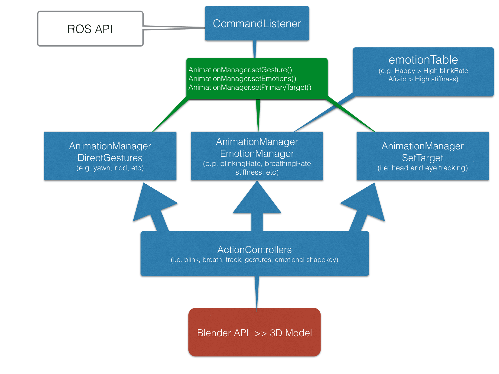

# Eva Blender Animation API #

This repository contains an animated model of the Eva head, as
a Blender file.  The head is driven by a collection of Python scripts known as the rigControl module. These controls can be activated from the
blender interface, or by sending specially crafted messages to a listener daemon.

# Demo #

This video shows what is currently possible: https://www.youtube.com/watch?v=s8Kwcor3CvY

# Running #

Pre-requisites: you must have a working version of Blender 2.72 or higher.

 * Start Blender, load Eva.blend.
 * From the top status bar, click on 'Reload Trusted' if a security prompt exists.
 * This will bring up a RigControl panel on the right.
 * Click on "Start Animation" to initialize the character.
 * The character should now be live, as indicated by eye movement and blinking.

# Command Listener #

* Comands may be sent through ROS to control Eva.
* The API is currently in draft stage: API_v1.pdf

# Design #

The CommandListener listens for and parses command from ROS.

The AnimationManager hosts majority of the character's state. 

The ActionControllers controls individual part of the character.

All the animations sequences and 3D data are stored in the Blender file.

The blenderPlayback.py file deals directly with Blender and runs the actual animations generated by ActionControllers.

The blenderUI.py file defines Blender interface used for debugging and controlling the character.

# Copyright #

Copyright (c) 2014 Hanson Robotics 

Copyright (c) 2014 Mike Pan

