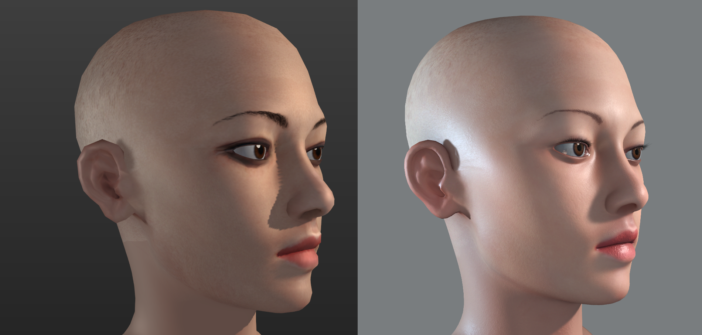
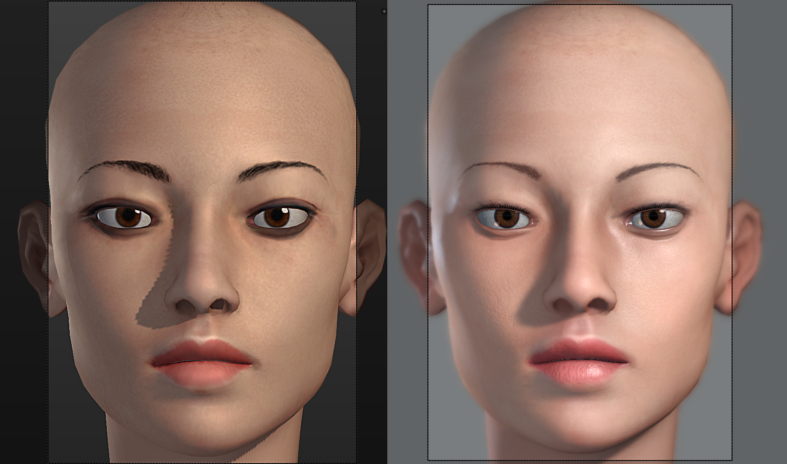
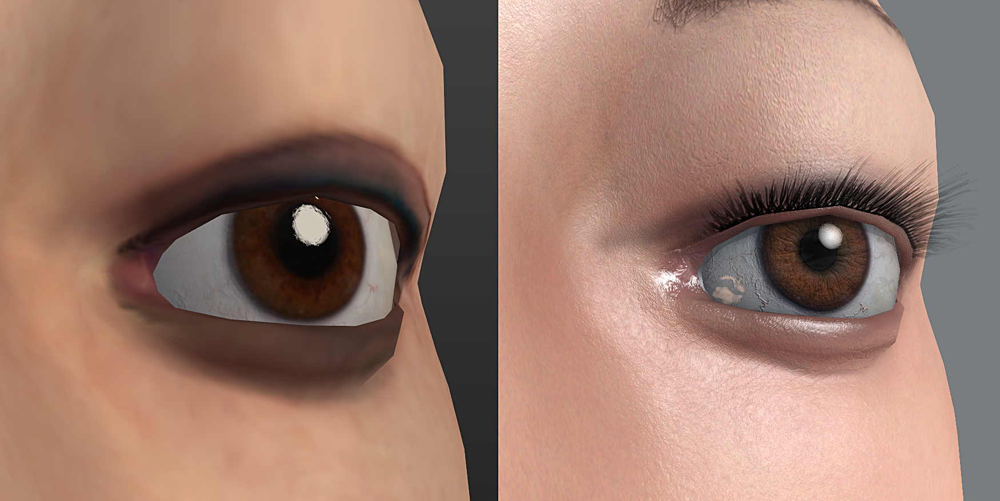

Eva2 Graphic Improvement Project
===

Eva2(Right) is based on Eva(Left), with numerous changes to the Blender file that improves the graphical representation of the face. It uses the same animation data and source code as Eva, so the two models can be used interchangeable.

- Eva.blend is recommended for development, as it is more performant.
- Eva2.blend is recommended for demo purposes.

---

### Eva1
Eva1 uses a single 2024x1024 color texture to define the surface detail of the face. The face is lit by three lights: a key light from camera right, a rim backlight from camera left, and a fill light from camera left.

System requirement:
Any reasonably modern desktop or laptop.
Blender 2.72 or higher.

---

### Eva2
Eva 2 uses many textures to define the surface detail of her face.

#### Skin:

- **Subdermal Layer:** Defined by a 512x512 texture, this layer defines the subdermal features under the skin. This is important to achieve realistic light penetration and scattering, in order to convey a 'softness' to the face.
- **Color Layer:** Defined by a 2048x2048 texture, this layer defines the epidermal features of the face. This layer controls the surface coloration and imperfections of the face. Any makeup would also go on this layer.
- **Displacement Layer:** Defined by a 4096x4096 texture, this layer defines the microdisplacement of the surface, creating pores, wrinkles, and bumps.
- **Gloss Layer:** Defined by a 1024x1024 texture, the Gloss layer controls the shiness of the face. This is used to achieve a 'wetness' around the eye and lips, and creates an 'oiliness' around the nose.

#### Eyes:
Much attention were given to the eyes, as it is the part of the face that we are most drawn to.

Whereas in Eva1, one texture is applied to a sphere to simulate the eyeball, in Eva2, the eyeball is remodeled such that the cornea and the iris are separate and physically accurate. This allows us to define two separate materials and create a much better sense of depth to the eye.

- **Eye**: The eye material uses a much higher resolution 512x512 texture for the iris, pupil and sclera.
- **Cornea**: The cornea uses a high specular material that mimics the wetness of the eyeball. It also allows the eye to catch light, making the eye feel a lot more alive.
- **Eye Lashes**: New geometry and textures are used to define the upper eye lashes.
- **Waterline**: Additional geometry are added where the eye and the eyelids meet, this allows the eye to 'sit' better inside the eye socket, and provides some shadowing that hints at the depth of the geometry better.

#### Lighting and Effects:
Aside from the three lights found in Eva1, an additional light was added to provide catch-light to the eye.

The specular highlight for the skin shader are two-lobed. One with a tigher falloff, and one with a much wider falloff. This simulates the skin surface in a much more accurate way. 
 
Camera depth of field effect is enabled to slightly blur out everything that's not in focus.

System requirement: An OpenGL 4 or DirectX 11 class GPU with 512MB of onboard RAM is highly recommended. Blender 2.74 or higher.

---

Comparison Shots

References:

- [Realtime Faces in Call of Duty](http://www.iryoku.com/next-generation-life)
- [Blender Depth of Field effects](http://wiki.blender.org/index.php/User:Psy-Fi/Framebuffer_Post-processing)
- [Physically Based shading and face rendering](http://www.crytek.com/download/2014_03_25_CRYENGINE_GDC_Schultz.pdf)
- [Eyes, Teeth and skin rendering](http://ict.usc.edu/pubs/ICT%20TR%2001%202010.pdf)