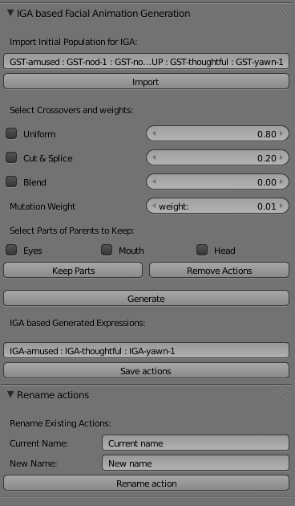
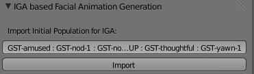
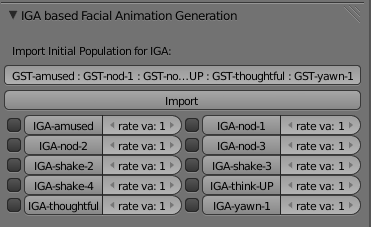
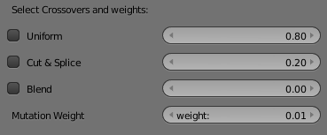
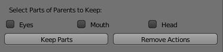
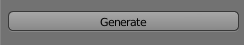
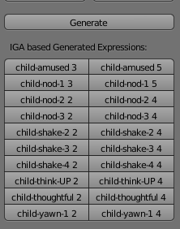
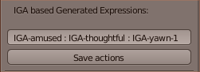
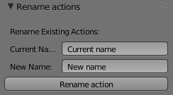

# Guideline of how to use the Animation Evolver through the Blender Interface. 

The description tries to highlight the included components and their respective UI from a perspective to enable users to run experiments with the tool:

* The screen capture above shows what the full UI interface of the Evolver looks like in general.

# Description of Each UI Parts:

* In the provided text box initial list of actions which will participate in the animation evolution process are provided; also users can change list of actions provided in the list as long as they provide animation names that are found in the blender instance (there is no limit to the number of actions/animations they can include).
The general format is to use is:
Actionname1: actionname2 : actionname3 etc. 
 

* After users enter list of actions they want to include in the evolution process then they hit the import button which will list down actions into a button along their tick their buttons and their rate value (default value is 1). 
The above screen capture shows a scenario of import button hit with only when list of actions provided by default are used.

* There are three types of crossovers techniques provided in the evolver; namely uniform, cut & splice and blend operators. The details of these algorithms in general can be found on different websites such as wikipedia.
Users can tick one or two of the crossovers and decide their weight. Where the maximum total weight is 1.

* Mutation is done on all animations that are rated 0. The weight amount determines the strength of the mutation on the action. It is generally adviced to keep its value lower (default value provided is 0.01).
 

* Once the crossover type/s and weight are decided, then select parts of facial parts is provided. 
There are three tick boxes; eyes, mouth and head. The user can select any number of actions in from the list (by ticking) and select parts (such as eyes, mouth and head) and finally hit the button Keep Parts.
These keeps parts of the selected animations to be kept without changing during a generation.
It is possible to do multiple selection of actions and tick the provided parts before doing the generation process.

* Each selection process will saved as long as the action and its selected part is unique. So this also means redoing the same process doesn't affect the array in any way.
Note that this functionality is provided for the uniform and blend operators. The reason it isn't provided for cut & splice is because its breeding style is basically parts based(such as eyes, mouth and head). So allowing to keep parts during this crossover would mean to see only very little movement during the evolution process.

* Remove button allows users to tick actions from the population list and remove it immediately. This functionality would be handy when action/s needs to be removed from the parent population list due to its poor significance to the next evolution process (or due their/its unfulfillment of any criteria the experimenter set) since every newly generated animations is automatically replaces the list of population/parents.

* After making sure the above procedures are done, hitting the Generate button would generate/evolve a new set of animations. 
Two of the procedures that must be done before being able to evolve are; one is to import initial set of population/parents (at least during the first generation process) and second is to select either one or two of the crossover operator provided. 
Process such as selecting facial parts from the parents and remove parent/s are optional.

* Note that all previous parents are always copied to a new list and 'child' and their generation number appended to their names as shown above.
The latest generation always replaces automatically the list where the parents were. A sample of copied parents few generations is shown above.

* Users can put names of list of evolved actions they want to save permanently. In order to list of animations just follow the format provided by default in the text box and then hit the save actions button. The concept of save means that each actions will be found afterwards once the users saves ('save as' would be better) the blend file at the end of the experiment. When re-opening the blend (new one) file only the evolved actions saved through the save actions button would be found. The reason is because blender doesn't automatically save actions even if the blend file is saved.

* In order to rename an action just enter its current name in the 'Current name' text box and its new name in the 'New name' textbox and hit Rename actions button. This would rename the action. 

