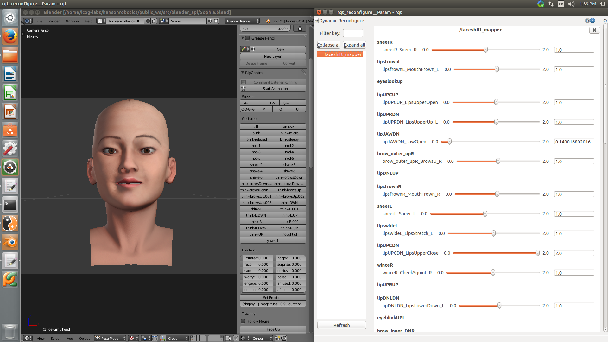

# Implementation internals

There are two nodes and configuration file in this package. The puppeteering_node and the blendshape_mapper. 

The first is faceshift to ROS wrapper that takes the faceshift network data by using their sample code and publishes the items to /blender_api/faceshift_blendshapes_values. 

The second is a node that remaps the topics from /blender_api/faceshift_blendshapes_values to /blender_api/set_shape_keys by reading the configuration files from dynamic reconfigure node. 

The configuration file generates header files and necessary parameters for topics mapped in the JSON file found in the sophia folder in faceshift_puppeteering node. This is done by following steps: 
* Reads the JSON file and create parameters based on those pairing by making the sophia's blendshapes group headers and the sophia_blendshapes and faceshift name to be attributes. 
* The blendshapes_mapper node then creates a server that listens to this parameters by iteratively going over the values and factors the blendshapes of faceshift before they are published on /blender_api/set_shape_keys. Thus the what this publishes are teh values that blender_api is going to assign to the rig. 

# To add new configuration
To create new mappings one needs only add shapekey name pair as follows: 

```json
...
	"brow_center_UP": [{
		"BrowsU_C_R": 1
	}],
	"brow_center_DN": [{}],
	"brow_inner_UP.L": [{}],
	"brow_inner_DN.L": [{
		"BrowsSqueeze_L": 1
	}],
	"brow_inner_UP.R": [{}],
	"brow_inner_DN.R": [{
		"BrowsSqueeze_R": 1
	}],

...
```

The first element is shapekey  name in Blender while the second is a list of pairs from the faceshift blendshapes. i.e BrowsU_C_R is a blendshape output while 1 is factor it's multiplied to give the values. Here it's essential that first element(sophia's blendshape names) MUST exists. Second one has to use profile that generates thes faceshift shift names specified here. for instance what we have found is the name pair L or R maynot be generated as it maynot be being generated from the tracking rig in blendshapes. 

# Running Details
There are three parts of code. 

First part is the part which listens to the Faceshift Network streaming using the faceshift network interface by using specified IP and port and publishes them to the /blender_api/set_shape_keys. This is launched via

    roslaunch faceshift_puppetering faceshift_puppetering.launch

This runs on localhost on 33433 port. If there is no element is terminates. If one desires to listen to a remote faceshift instance. 

    roslaunch faceshift_puppetering faceshift_puppetering.launch IP:=ip_host Port:=port_num
    
This node is entirelly independent of the the type of shapekeys being sent from the faceshift. It just prints key value pair of the name of shapekey with it's value. 


The second one are the internal changes to the blender_api to listen to this published topics 

    rostopic pub /blender_api/set_animation_mode blender_api_msgs/AnimationMode "value: 0" --once # to set the mode as normal.
    
    rostopic pub /blender_api/set_animation_mode blender_api_msgs/AnimationMode "value: 1" --once # to set the mode as faceshift led pupeetering.

The third ones are ways to configure the Faceshift and Sophia Blendshapes mapping. This has to folds: 
1. Manually Edited basic file. Found in sophia folder in faceshift_puppeteering folder. 
2. Dynamically reconfigure the parameters list during run time to see the effects of different elements. 

One can be able to edit this parameters by running: 

	rosrun rqt_reconfigure rqt_reconfigure

Then going to faceshift_mapper to reconfigure the values. 



When animation mode is set to '1' the AnimationManager 
1. First saves all the drivers of the shapekeys that are going to be driven by faceshift (found by reading the JSON file) by iterating through them. 
2. Delete all the drivers of elements found in the keyshape pair json file.
3. Sets the value of the shapekeys to the value of the faceshift value by adding them or subtracting them as they are specified. Currently we just mapped the shapekeys of blender to faceshift one to one. 

When animation mode is set to '0' the AnimationManager returns the values of the drivers to the way they were before deletion occured. 


# Critical
The blender_api modification made it necessary that we specifiy mapping parameters between the two types of blendshapes(the one in sophia's rig and the blendshape of faceshift) that we used a specific model of the 
faceshift model to create a more suitable mapping. This made the total shapekeys being sent form the faceshift interface about 57. This are described in the faceshift profile found the profiles folder. So be sure to 
have that otherwise it would give out an error saying that a certain shapekey is missing. And a mapping file is placed in the robots_config/shapekey_pairing.json

# TODOs
* Use the Parameters to set the animation mode rather than topics. 
* Make a method to create new relations between elements as it currently stands one has to modify the JSON file first to create new relations and then modify them with dynamic_reconfigure. 
* Implement Logging to indicate internal state of the nodes. 
* Embed the launcher in other nodes. 
* Check integrity of the code. 
 

