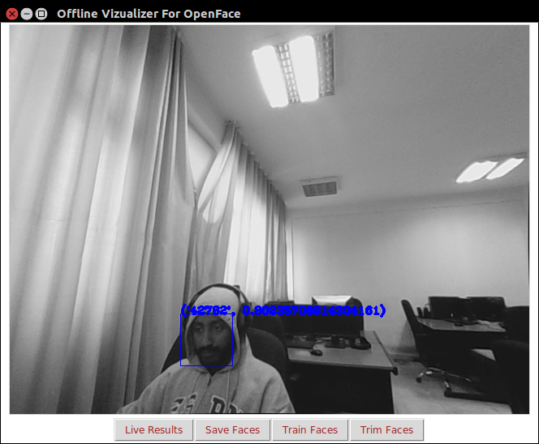
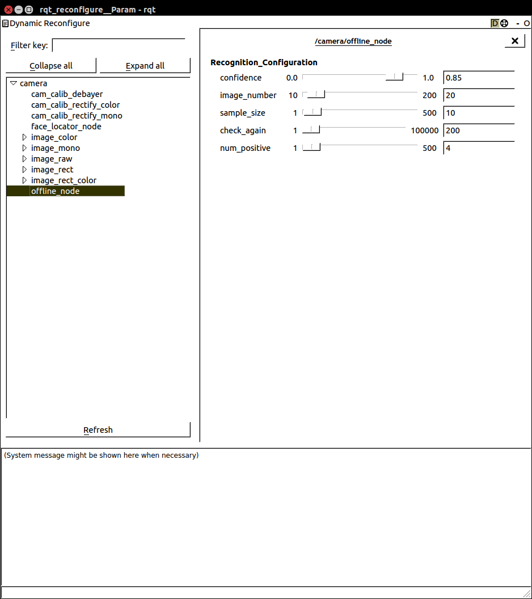

This the a wrapper code for CMT. 

#Build
As this code is dependent on the CppMT libary which it wrapps around it's always should be updated before
building this particular code the time being to reflect the latest changes availble in that repo.

        ./hrtool -i # Install dependecies

        ./hrtool -v # Update vision_tools dependecies (CppMT)

        ./hrtool -b # Build the library.

#Running
Launching it from scripts directory to launch it.

        ./vision.sh cmt

To pi_vision pi_vision

        ./vision.sh pi_vision

Trimming dataset and creating classifiers before the system is run. Eventhough
during run time we can create classifiers if the aggregated confidence of face during a pritcular period of
time is less that (dynamically reconfigurable value) one can add additional faces to train the dataset on and
thus run have a new dataset available during each particular run of openface in face_recongizner node.

# How the CMT Tracker Works

The cmt_tracker pipeline has the following three nodes working in combination to create the effect; 

1. Face Locator Node
    face_locator_node.cpp is node that runs dlib and opencv face classifiers in parallel and combines the results and 
    outputs cmt_tracker_msgs::Objects message.In the case of dlib we run also the landmark annotator that is essential for 
    the recognition pipeline. The output of this node is published to the topic found by parameter 
        
        nh_.getParam("filtered_face_locations", publish_topic);
        
    The default setting of this parameter is defined in [cmt_launcher](launch/cmt_launcher.launch)
    
    The output is an array of the cmt_tracker_msgs::Object arrays and has the following format; 
            ```
            
            Header header
            sensor_msgs/RegionOfInterest object
            std_msgs/Int32 id
            std_msgs/String obj_states
            std_msgs/Float64 obj_accuracy
            opencv_apps/Point2DArray feature_point
            geometry_msgs/Pose pose
            std_msgs/String tool_used_for_detection
            
            ```
    The header is published to enable time stamp as most of the code in this repository utilizes message filter policies to synchronize the different messages. 
    sensor_msgs/RegionOfInterest is the area of the face that is located.
    id is place holder currently; 
    obj_state and obj_accuracy are for emotime results(not used in face_locator_node).
    feature_point is available for dlib outputs and represents an array of landmark locations.(Notice that this is doesn't come default with your ros installation and make sure to ros-indigo-opencv-apps )
    pose represents the orientation of the head for dlib instances. 
    The last one and that is important is tool_used_for_detection output; There are three outputs for this string. 
        ```
        
        "dlib_u" -> For face detected by dlib and opencv
        "dlib" -> face recognized by dlib only 
        "opencv" -> face detected by opencv only and thus doesn't have landmarks and pose. 
        ```
    * Train face detectors for better outputs. 
    * Include pose and landmarks for the opencv detected faces.
    * Add reconfiguration options. 

2. CMT Wrapper Node :
     cmt_tracker_node.cpp is node that wraps the CppMT. It has a different configuration that wrap around CMTMAP functionalitiy
     like deleting, merging and reforcing tracking instances. It also has parameters to pass to the CMTMAP. 
     
    The cmt tracker after face is added to it(via method described below) operated in the following manner:
    
    1. Initially the faces is added to temporary trackers(it's just a boolean value it's still in the same map); It waits  there till it's reinforced X times(described in the face_reinforcer.py description). This doesn't ***trigger new face 
     event or lost*** . If the decreasing counter reaches zero then it would quietly go away. 
     
    2. Once a face is reinforced; it would be in the validated tracker queue. This ***triggers a new face event*** i.e new face events thus are when published when a face moves to validated trackers. 
     
    3. Whether it's in the validated queue or temporary queue there is a deceasing counter that descreases every frame. This is to avoid or to lose trackers that haven't detected faces in the past x frames. This is described in detail in face_reinforcer
    description.
    
    
    * Adding to track -cmt_tracker_msgs::Object published on "tracking_location" or "tracking_locations" calls addtomap function of CMTMAP
    
    * Services
    
        * "clear" - remove all tracking instances from the map. Also triggers lost_face events. Known caller; cmt_tracker_view remove_all tracked button
        * "get_cmt_rects" - get the cmt initial images that the cmt is tracking. This is not automatically called as it has speed effects but 
        can be used to query using Get Internal State of CMT button in the cmt_tracker_view. This is very useful to check if 
        indeed the cmt is tracking a face or not. 
        * "update" - obsolete now; but could be used to trigger updating the cmt_tracker_view when a state changes
        * "recognition" - since cmt_tracker_node is the one that mimicks the behaviour of pi_vision; and due to desirability of publishing the data once 
        (and thus avoiding dealing with timestamps.) this service calls and attaches a particular name that has been recognized by 
        openface to the tracker. This is a work around. 
        * "reinforce" - the cmt instance is reinforces and thus a map element is reinforced by calling this service.  
        * "merge" - this merges a two trackers to the smaller one. This doesn't really validate the good one is kept though.  
        * "delete"- this service deletes elements from the queue. 
        * "update_area" - In developement; to utilize reinforcements to fine tune to track a specified face. 
    * Events -
        Calls new_face and lost_face events for new faces and lost/deleted/merged faces that are no longer published. 
 3. face reinforcer node 
This node adds, reinforce and removes tracker instances based on different criteria. 
 * Adding Tracker  
It checks for an ovelap between output of face_locator node and cmt_tracker_node and if there are faces in face_locator_node
not covered in the cmt_tracker_node it adds them to the internal queue to be added as in: 

Next time: when a face is not covered by the cmt_tracker then it would check the absolute difference between the previously 
not covered face and current not covered face and checks if the difference is below dynamically reconfigure parameters 
  


   ```python
    [[178, 76, 303, 76, 0, 'dlib', '0000000011']] 
    [[178, 76, 303, 76, 1, 'opencv', '0000000111']]
    [[178, 76, 303, 76, 2, 'opencv', '0000001110'], [164, 91, 304, 91, 0, 'dlib', '0000000010']]
    [[178, 76, 303, 76, 3, 'opencv', '0000011101'], [164, 91, 304, 91, 1, 'opencv', '0000000101']]
    [[178, 76, 303, 76, 4, 'opencv', '0000111011'], [164, 91, 304, 91, 2, 'opencv', '0000001011']]
    [[178, 76, 303, 76, 5, 'opencv', '0001110111'], [164, 91, 304, 91, 3, 'opencv', '0000010111']]
    [[178, 76, 303, 76, 6, 'opencv', '0011101110'], [164, 91, 304, 91, 4, 'opencv', '0000101110']]
    [[164, 91, 304, 91, 5, 'opencv', '0001011101']]
   ```
  

 * Reinforce Tracker
 
 * Remove Tracker

# How to use the Offline Trainer. 

OpenFace uses images to train it's dataset. So to check the available set of iamges that we are going to train the system. 
Go to HEAD/src/vision/images/Faces

To start offline or create your own trainer go to: 

    ./vision.sh cmt_offline

This would create the folloiwng tkinter based UI. 



There are three modes this offline trainer operates

1. If there is an existing trained model for the openface exists; (one can check if an exiting model exists by going to; 
HEAD/src/vision/images/feature/ ; The cmt_offline application then starts from a live mode as in the above figure. Since 
openface doesn't have unknown classes(https://github.com/cmusatyalab/openface/issues/144) it would always output a results 
as in the above in (detected_face,confidence) i.e (42782, 0.6023). At this stage to view the faces that openface is trained 
on (unless removed explictly) can be found (HEAD/src/vision/images/faces)

2. Adding faces to the dataset; Currently to add images to the application there is MAKE sure THERE IS ONLY ONE PERSON 
in the view and clicked save. It would continue saving till the image number specified on the rqt_reconfigure values is matched. 

    rosrun rqt_reconfigure rqt_reconfigure
    
Once the dynamic reconfigure is loaded you would see an image as the following figure illustrates. The image_number is 
the only one that is relevant to cmt_offline node as it affects the number of image that are saved when the user clicks save.
 
NOTICE: If you haven't manually changed the dynamic recnofigure the iimages it saves are 20 which isn't quite low. 

Once it reaches the designated number of images it stops saving and reverts back to the live results. NOTICE: It hasn't 
trained yet to allow user to add other images before training the dataset. 

3. Training the dataset; 

Once you add different images to the dataset (remember one person in frame at a time) check the different images in the 
HEAD/src/vision/images/faces (if there are no images here be sure to check HEAD/src/vision/images/temp as it hasn't moved 
the images from that directory as it hasn't reached the image_number specified in the rqt_reconfigure. Also check for redundacies
same people masquerading as different people. And it's OKAY to manually delete different faces or add to them. Once checked to train
click on train; Once it's finished with training it would revert back to the live session mode .




# Configuration 


# Urgent TODO's

* Increase the training of the dlib object detetor or utilize higher FP opencv classifiers to reinforce temporay trackers
to push them to the main tracker queue.

#TODO
* Enable gaze, attention and emotime output into the the relevant code.
* Write Tests.
* Remove unnecessary arguments and parameters in the launcher and code so to make it entirely configurable.
* Write a documentation and clear API to trigger adding faces to the dataset.
* Resolve how to deal with the openface current limitiation that training can be done from the local image.
* Help implement the issues discussed at this parituclar locations: https://github.com/cmusatyalab/openface/issues/144
* Pose based image saving for variety. 
